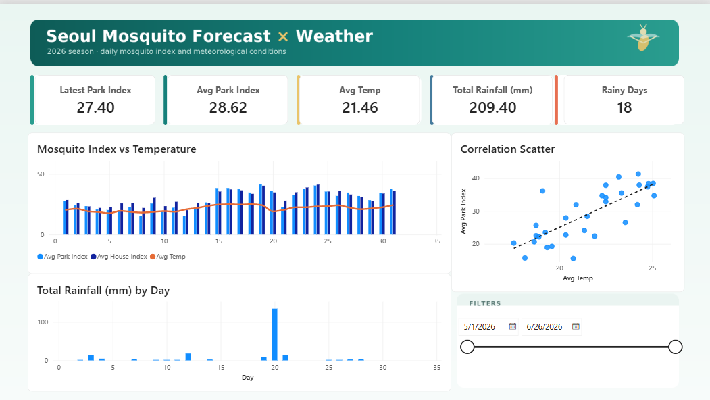

# Seoul Mosquito Forecast × Weather Dashboard

A Power BI dashboard exploring how **mosquito activity in Seoul tracks daily weather** during the 2026 season (May 1 – June 26, 2026), built from two Korean public-data APIs.



## Key finding

**Mosquito activity rises strongly with average temperature (Pearson r ≈ 0.81), but shows essentially no linear relationship with same-day rainfall or humidity (r ≈ 0).**

> Note: the waterside index (`Idx_Water`) is capped at 100 on 39 of 57 days, so the **park** and **residential** indices are the meaningful measures.

## Data sources

| Dataset | Source | Notes |
|---|---|---|
| Mosquito Forecast (모기예보제) | [서울 열린데이터광장](https://data.seoul.go.kr/dataList/OA-13285/S/1/datasetView.do) — `MosquitoStatus` Open API | Daily index (0–100) for waterside / residential / park. One record per API call. |
| Daily weather (지상 ASOS 일자료) | [공공데이터포털 / 기상청](https://www.data.go.kr/) — ASOS daily, station **108 (Seoul)** | Avg/min/max temp, rainfall, humidity, wind. Date-range query. |

Both datasets are published under **공공누리 제1유형 (KOGL Type 1)** — free to use with attribution.

## Tools

- **Power BI Desktop** — data model, DAX measures, visuals
- Data pulled via the public APIs above; cleaned and shaped into a star schema (CSV)

## Repository structure

```
.
├── README.md
├── PowerBI_Build_Guide.md      # step-by-step: model, relationships, DAX, visuals
├── CLEANING_NOTES.md           # what was cleaned + data-quality flags
├── mosquito_weather.pbix       # the Power BI report (save yours here)
├── raw/                        # untouched API pulls
│   ├── mosquito_raw_2026.csv
│   └── weather_raw_2026.csv
├── cleaned/                    # Power BI-ready tables (star schema)
│   ├── dim_date.csv
│   ├── fact_mosquito.csv
│   ├── fact_weather.csv
│   └── combined_mosquito_weather.csv
├── design/                     # page background + color theme
│   ├── mosquito_weather_background.png
│   └── mosquito_weather_theme.json
└── images/
    └── dashboard.png           # screenshot shown above
```

## Data model

A simple star schema: one date dimension feeding two fact tables.

```
fact_mosquito ──► dim_date ◄── fact_weather
                  (Date)
```

Relationships are **many-to-one** from each fact table to `dim_date[Date]`, single cross-filter direction. See [`PowerBI_Build_Guide.md`](PowerBI_Build_Guide.md) for the full build (measures + visuals).

## Reproduce / open

1. Clone the repo.
2. Open `mosquito_weather.pbix` in **Power BI Desktop** (free).
3. To refresh with new dates: re-pull the APIs, overwrite the files in `cleaned/` (same names), and hit **Home → Refresh**.

## Method summary

- **Mosquito API** returns one day per call (no range support) → the season was pulled day by day.
- **Weather API** supports a date range → pulled in a single call.
- Cleaning: friendly column names, numeric type-casting, blank rainfall → 0, duplicate/continuity checks (none missing), and a generated `dim_date` calendar. Details in [`CLEANING_NOTES.md`](CLEANING_NOTES.md).

## Caveats

- Correlation, not causation — temperature co-moves with the season; a controlled model isn't implied.
- Same-day rain shows no effect, but a *lagged* effect (standing water → larvae, ~1–2 weeks later) isn't tested here.
- One season to date (57 days); patterns may shift with more data.

## License

Code/markdown in this repo: MIT. Underlying data: © 서울특별시 / 기상청, KOGL Type 1 (attribution).
